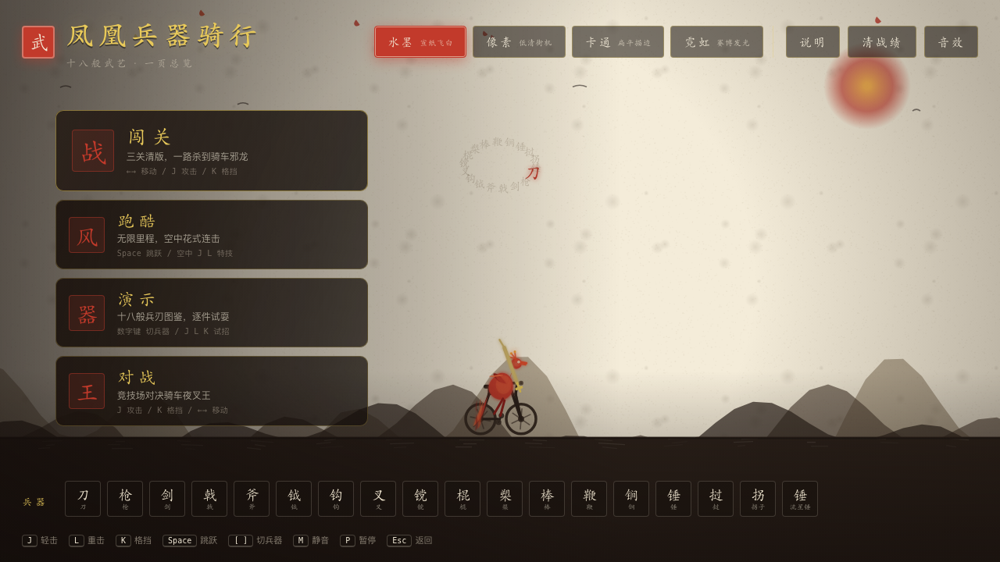
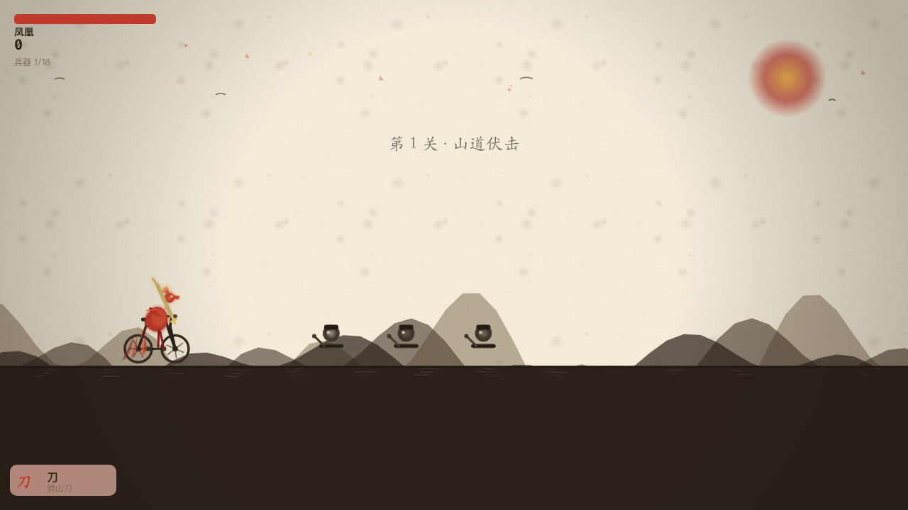
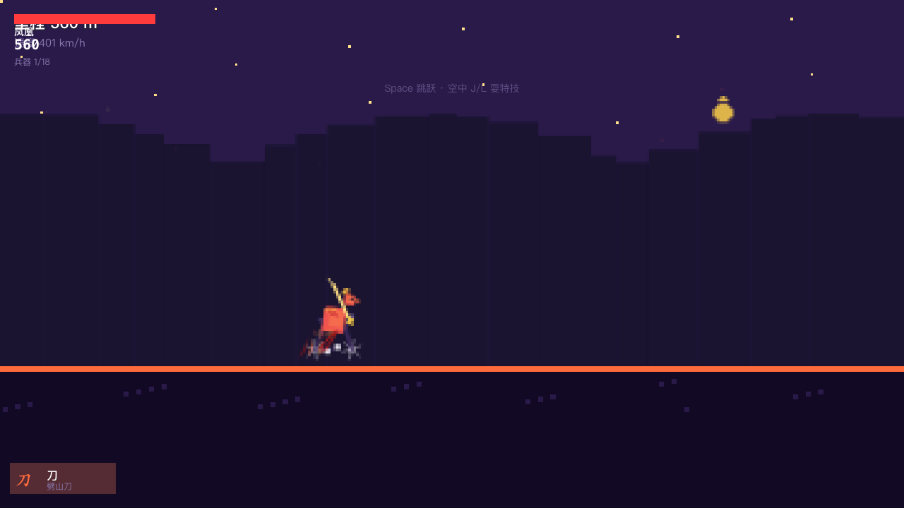
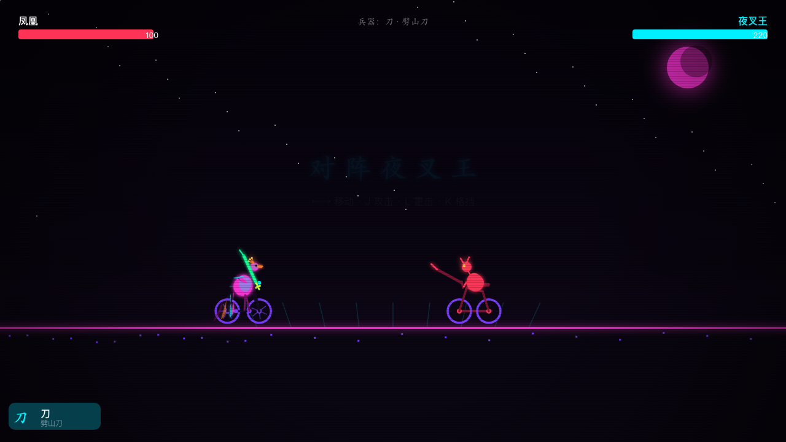
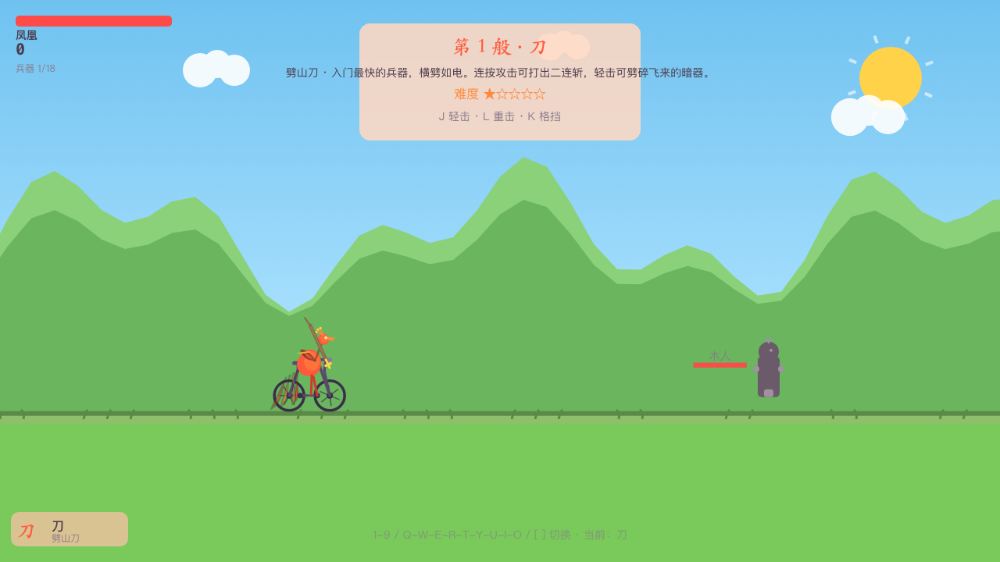
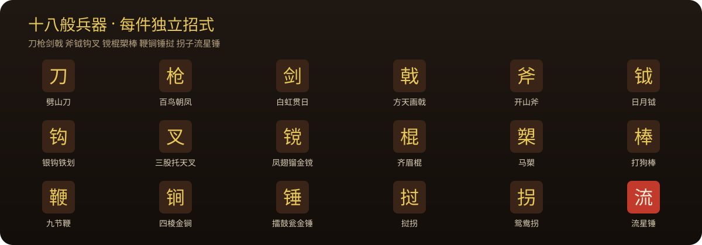
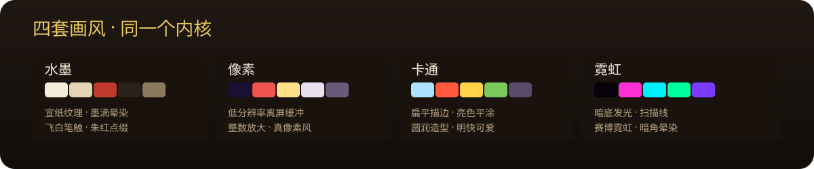
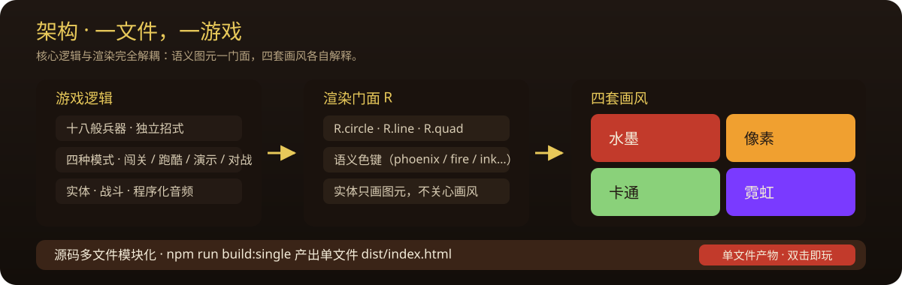

# 凤凰兵器骑行 · 十八般武艺

<p align="center">
  
</p>

> 一只火凤凰，骑着自行车，用十八般兵刃一路过关斩将。
> **零依赖 · 单文件 · 双击即玩**。

| | |
|---|---|
| 🎮 玩法 | 闯关 · 跑酷 · 演示 · 对战（四模式） |
| 🎨 画风 | 水墨 · 像素 · 卡通 · 霓虹（同一内核换皮） |
| 🗡 兵器 | 十八般，件件独立招式 |
| 📄 分发 | 单个 `index.html`，离线自包含 |
| 🔊 音频 | Web Audio 程序化国风合成，零音频文件 |

## 实机画面

<p align="center">
  
</p>

四种玩法 × 四套画风，任意组合可跑：

| 闯关 · 水墨 | 跑酷 · 像素 |
|---|---|
|  |  |

| 对战 · 霓虹 | 演示 · 卡通 |
|---|---|
|  |  |

## 快速开始

**方式一：直接双击 `index.html`**。无需服务器、无需安装任何依赖，`file://` 打开即玩。

**方式二：本地起服务。**

```bash
python3 -m http.server 8177
# 打开 http://localhost:8177
```

> **可观察的成功**：页面打开即见「武阁」主界面，凤凰在画布中骑行、兵器环绕；按 Enter 或点击「闯关」即可开打。

## 十八般兵器

<p align="center">
  
</p>

每件兵器**独立招式与手感**，非换皮：

- 剑：格挡反弹暗器；钩：把敌人拉过来；斧 / 锤：重击震地波
- 流星锤：环绕甩击；棍：旋转格挡气墙；槊：超长蓄力穿刺；拐子：格挡反击
- 数字键 `1-9` / 字母键 `Q-W-E-R-T-Y-U-I-O` / `[ ]` 随时切换

## 四种玩法

<p align="center">
  
</p>

| 模式 | 玩法 |
|---|---|
| **闯关** | 横版清版，三关一路杀到骑车邪龙 Boss，波次刷怪、连击评分、招式落款 |
| **跑酷** | 无限里程自动前进，跳障碍、砸障碍、空中特技连击刷分 |
| **演示** | 十八般兵刃图鉴，逐件试耍，招式名 / 手感 / 难度卡片，木人陪练 |
| **对战** | 竞技场对决骑车夜叉王，攻防克制、格挡反击 |

## 四套画风

<p align="center">
  
</p>

| 画风 | 特色 |
|---|---|
| 水墨 | 宣纸纹理 · 墨滴晕染 · 飞白笔触 · 朱红点缀 |
| 像素 | 低分辨率离屏缓冲 · 整数放大 · 真像素风 |
| 卡通 | 扁平描边 · 亮色平涂 · 圆润造型 |
| 霓虹 | 暗底发光 · 扫描线 · 赛博霓虹 |

## 操作

| 键 | 功能 |
|---|---|
| `← →` / `A D` | 移动 |
| `Space` / `↑` / `W` | 跳跃（跑酷：空中按键 = 特技） |
| `J` | 轻击 |
| `L` | 重击 / 蓄力 |
| `K` / `Z` | 格挡（剑=反弹，棍=气墙，拐子=反击） |
| `1-9` / `Q-W-E-R-T-Y-U-I-O` | 切换十八般兵器 |
| `[` / `]` | 兵器前后循环 |
| `P` / `Esc` | 暂停菜单（继续 / 重新开始 / 游戏说明 / 返回主界面） |
| `M` | 静音 |
| `Enter` / `R` | 重试 |

## 架构 · 一个内核，四种画风

<p align="center">
  
</p>

**核心逻辑与渲染完全解耦**：实体只调用语义化图元（`R.circle / R.line / R.quad` + 语义色键），四套渲染器各自解释图元与配色，因此 4 模式 × 4 画风任意组合可跑。

源码按职责组织在 `js/` 与 `css/`，经典 `<script>` 顺序加载规避 file:// CORS：

```
js/
├── core/        utils · input · audio · particles · combat · world · draw · engine
├── weapons/     weapons.js（十八般兵器定义，独立招式）
├── entities/    player(凤凰+自行车) · enemies · projectiles
├── render/      index · base(共享基座) · ink · pixel · cartoon · neon · weaponDraw
├── modes/       index · story(闯关) · endless(跑酷) · gallery(演示) · battle(对战)
└── main.js      Hub 入口与路由
css/style.css    武阁设计系统
```

需要"一个文件发人"时，构建为单文件：

```bash
npm run build:single   # 产出 dist/index.html（CSS+JS 全内联，双击即玩）
npm run verify:dist    # 无头浏览器验证单文件产物可运行
```

## 战绩与隐私

- 唯一持久化：浏览器 `localStorage`，键名 `war18_best_v8`（按发布版本命名空间隔离，旧版本数据不串）。**无任何网络请求**，数据只留本机。
- 存储不可用（隐私模式等）时自动降级为纯内存，游戏照常。
- 分发清洁：
  - `?fresh=1`：本次会话完全不读不写存储（纯内存无痕运行）
  - `?reset=1`：打开即清空战绩，再正常游玩
  - Hub 顶栏「清战绩」印章按钮可随时手动清除

## 自动化测试

```bash
npm install   # 安装测试依赖（游戏本体零依赖，单文件双击即玩）
npm test      # 类型检查 + 冒烟 + e2e 浏览器测试
```

| 闸门 | 覆盖 |
|---|---|
| `test:types` | `tsc --noEmit`（`js/**` 类型检查） |
| `test:smoke` | 桩 DOM 加载全部模块 + 逻辑 / 绘制断言 |
| `test:e2e` | Playwright 真实浏览器逐像素验证，25 项（含单文件产物回归） |

e2e 覆盖：四画风玩家可见、四模式可启动、18 兵器逐一造成伤害、输入控制、暂停 / 帮助 / 返回、DPI 适配、四画风 × 四模式零控制台错误。

## 说明

- 游戏本体零依赖，只有开发测试需要 `npm install`（Playwright + TypeScript）。
- 采用 **MIT** 许可，见 [LICENSE](LICENSE)。
